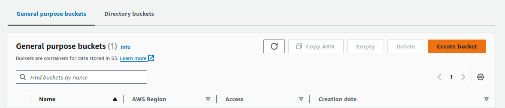
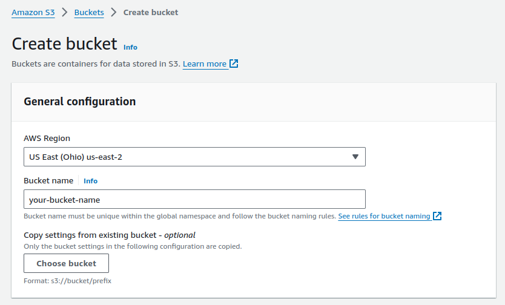
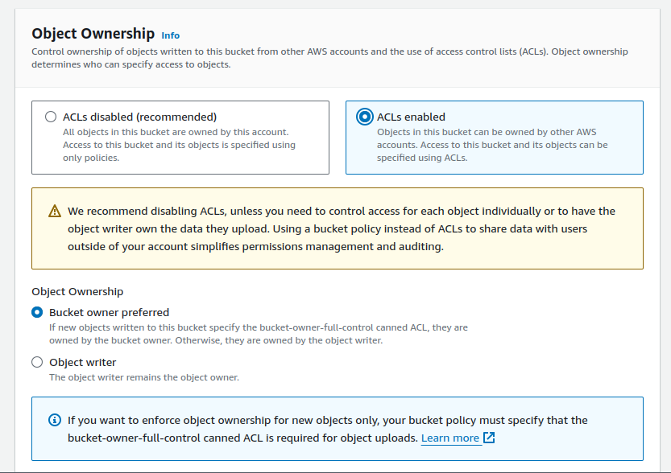
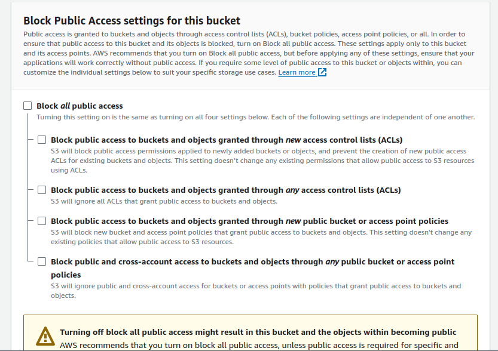

# financeiro-api
Personal Finance Application

## Overview
This is an app based on algamoney-api project from Algaworks company for personal finance management.
The goal is optimize to run on Kubernetes using the best practices such as security, monitoring and automation.

## Prerequisites

### Backend
SDKman(Optional)
  ```bash
  # Just launch a new terminal and type in
  curl -s "https://get.sdkman.io" | bash
  # Run the following command
  source "$HOME/.sdkman/bin/sdkman-init.sh"  
  # Check the sdk version
  sdk version  
  ```

Java 21(Optional)
  ```bash
  # List java versions available in sdk:
  sdk list java
  # Install java
  sdk install java 21.0.2-graalce  
  # Check the java version
  java --version   
  ```

Maven 3.9.6(Optional)
  ```bash
  # List maven versions available in sdk:
  sdk list maven
  # Install maven
  sdk install maven 3.9.6
  # Check the maven version
  mvn --version    
  ```

IntelliJ IDEA(Optional) - https://www.jetbrains.com/idea/download/download-thanks.html?platform=linux&code=IIC
```bash
sudo tar -xzf ideaIC-*.tar.gz -C /opt
cd /opt/ideaIC-*/bin
./idea.sh
# Desktop Icon
Open IntelliJ IDEA -> Tools -> Create Desktop Entry
```

Dbeaver(Optional) - https://dbeaver.io/files/dbeaver-ce-latest-linux.gtk.x86_64-nojdk.tar.gz
```bash
sudo tar -xzf dbeaver-ce-24.0.0-linux.gtk.x86_64.tar.gz -C /opt
cd /opt/dbeaver
./dbeaver
# Execute the Symbolic link command inside Desktop folder
ln -s /opt/dbeaver/dbeaver DBeaver
```

Postman(Optional) - https://dl.pstmn.io/download/latest/linux_64
```bash
sudo tar -xzf postman-linux-x64.tar.gz -C /opt
cd /opt/Postman
./Postman
# Execute the Symbolic link command inside Desktop folder
ln -s /opt/Postman/Postman Postman
```

Docker(Required)
```bash
apt-get update
apt-get install curl -y
curl -fsSL https://get.docker.com/ | bash
docker version
```

Kind(Required)
```bash
curl -Lo ./kind https://kind.sigs.k8s.io/dl/v0.27.0/kind-$(uname)-amd64
chmod +x ./kind
sudo mv ./kind /usr/local/bin/kind
kind version
```

Kubectl(Required)
```bash
curl -LO https://dl.k8s.io/v1.33.0/bin/linux/amd64/kubectl
chmod +x ./kubectl
sudo mv ./kubectl /usr/local/bin/kubectl
kubectl version --client
```

Helm(Required)
```bash
curl -fsSL -o get_helm.sh https://raw.githubusercontent.com/helm/helm/main/scripts/get-helm-3
chmod 700 get_helm.sh
./get_helm.sh
rm get_helm.sh
```

***
## Environment Setup
Note: Check if the OS distribution is using cgroups v2. 
More details access https://kubernetes.io/docs/concepts/architecture/cgroups/.

***
### Configure fake DNS local
- Check the CIDR from docker network:
```bash  
  docker network inspect -f '{{.IPAM.Config}}' kind  
```
Note: The result is similar to this: [{172.18.0.0/16  172.18.0.1 map[]}

- In the terminal, change the hosts file:
  ```bash
  vi /etc/hosts
  ```

- Add the line below and save the file(use the IP range from CIDR):
  ```bash  
    172.18.255.17   app.financeiro.com locust.financeiro.com   
  ```

***
### Configure metallB address pool
- Set the IP range CIDR in the ip-addresspool.yaml(k8s/chart/templates/metallb/config/):
```bash   
   addresses:
   - 172.18.255.17-172.18.255.20  
```

***  
### AWS
- Visit the AWS website: [AWS](https://aws.amazon.com/pt/free/?gclid=CjwKCAiAq4KuBhA6EiwArMAw1EJHjIbw370Wee1sIBSFwr6Hd4-fT_CVkGvCWKAAA-w73beFZRKIzxoCJUcQAvD_BwE&trk=2ee11bb2-bc40-4546-9852-2c4ad8e8f646&sc_channel=ps&ef_id=CjwKCAiAq4KuBhA6EiwArMAw1EJHjIbw370Wee1sIBSFwr6Hd4-fT_CVkGvCWKAAA-w73beFZRKIzxoCJUcQAvD_BwE:G:s&s_kwcid=AL!4422!3!561843094929!e!!g!!aws!15278604629!130587771740&all-free-tier.sort-by=item.additionalFields.SortRank&all-free-tier.sort-order=asc&awsf.Free%20Tier%20Types=*all&awsf.Free%20Tier%20Categories=*all)
- Log in or create an AWS account
- Generate a AWS secret and key_id and export them into your .bashrc
export AWS_SECRET_ACCESS_KEY=YOUR_AWS_SECRET
export AWS_ACCESS_KEY_ID=YOUR_AWS_KEY_ID
- Search for the service S3 and create a bucket following the configuration instructions:  

  1. Create a bucket in the S3 home page
  Note: Set the AWS_BUCKET_NAME in values.yaml(k8s/chart)

  

  2. In **General Configuration**, set the AWS Region to "us-east-2" and choose an available name for your bucket

  

  3. In **Object Ownership**, enable ACLs

  

  4. In **Block Public Access settings**, uncheck the first box

  

  5. All the settings that were not mencioned above can be left as default. Click on **"Create bucket"** at the at end of the page.

***
## Running application on Kubernetes
Note: Check if all required applications were installed. See Prerequisites. 

- Access k8s folder:
  ```bash
  cd k8s
  ```
- Execute the command:
  ```bash
  make
  ```
- Check if all pods are Running status:
  ```bash
  kubectl get pods -n financeiro
  ```
- After that, open the Postman and import the collections and envs. Check docs/postman directory.

***
## Database access
- Execute the command below:
  ```bash
  kubectl port-forward svc/mysql-app 3308:3306 -n financeiro
  ```

- Open DBeaver and create a new connection using this configuration:
  ```bash
  url=jdbc:mysql://localhost:3308/
  host=localhost
  port=3308
  username=financeiro
  password=Financeiro123456789@
  ```

***
## Prometheus
- Execute the command below:
  ```bash
  istioctl dash prometheus -n monitoring
  ```
Note: This command opens the Prometheus on browser. After that, go to the Status menu and click on Target health

***
## Locust(Stress Test)
- Open the browser using the following url and after populate the fields click NEW button:
  ```bash
  http://locust.financeiro.com
  ```
Note: For the Host field put the value http://financeiro-api.financeiro.svc.cluster.local:9090